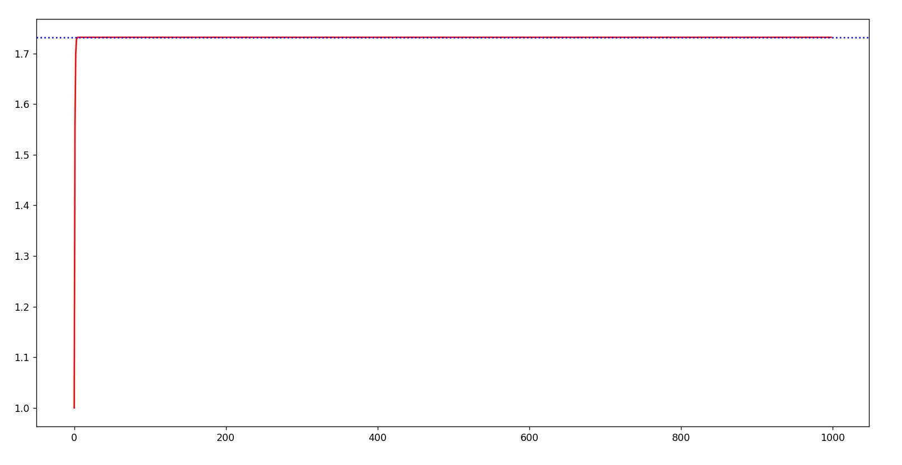
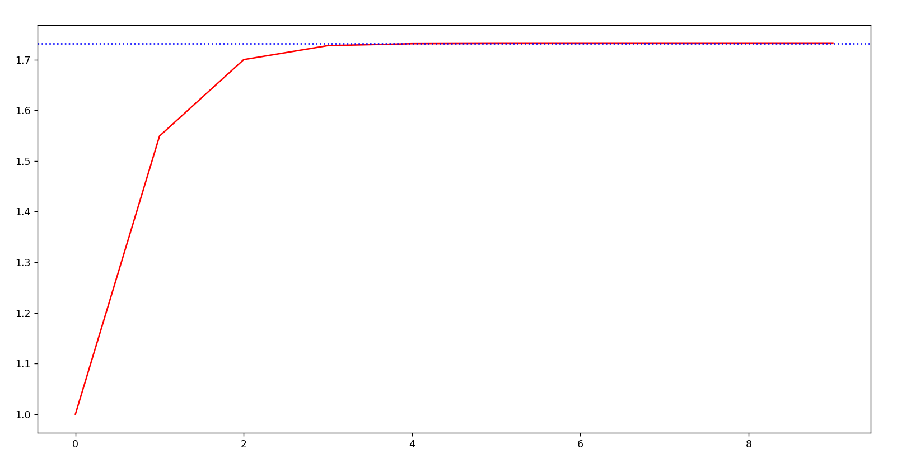

# Formula

This is a formula for calculating exact value of any root of any number.

This is a trash formula and is purely for fun.

## Example

```sh
$ py formula.py
Enter m: 2
Enter x: 3
Enter repeat: 999
100%|████████████████████████████████████████████████████████████████████████████████████████████████████████████████████████████████████████████████████████████████████████████████████████████████████████████████████████████| 999/999 [00:45<00:00, 22.09it/s]
Normal Root:  1.73205080756887729352744634150587236694280525381038062805580697945193301690880003708114618675724857567562614141540670302996994509499895247881165551209437364852809323190230558206797482010108467492326501531234326690332288665067225466892183797122704713166036786158801904998653737985938946765034750657605075661834812960610094760218719032508314582952395983299778982450828871446383291734722416398458785539766795806381835366611084317378089437831610208830552490167002352071114428869599095636579708716849807289949329648428302078640860398873869753758231731783139599298300783870287705391336956331210370726401924910676823119928837564114142201674275210237299427083105989845947598766428889779614783795839022885485290357603385280806438197234466105968972287286526415382266469842002119548415527844118128653450703519165001668929441548084607127714399976292683462957743836189511012714863874697654598245178855097537901388066496191196222295711055524292372319219773826256163146884203285371668293864961191704973883639549594
Hyunseung Root:  1.73205080756887729352744634150587236694280525381038062805580697945193301690880003708114618675724857567562614141540670302996994509499895247881165551209437364852809323190230558206797482010108467492326501531234326690332288665067225466892183797122704713166036786158801904998653737985938946765034750657605075661834812960610094760218719032508314582952395983299778982450828871446383291734722416398458785539766795806381835366611084317378089437831610208830552490167002352071114428869599095636579708716849807289949329648428302078640860398873869753758231731783139599298300783870287705391336956331210370726401924910676823119928837564114142201674275210237299427083105989845947598766428889779614783795839022885485290357603385280806438197234466105968972287286526415382266469842002119548415527844118128653450703519165001668929441548084607127714399976292683462957743836189511012714863874697654598245178855097537901388066496191196222295711055524292372319219773826256163146884203285371668293864961191704973883639549591
Error: 3E-998
```

Here, m is the root number, x is the number, and repeat is the number of times to repeat the calculation.

This results in a pretty good approximation of the root.



To get a closer look, you can make the repeat value smaller.


